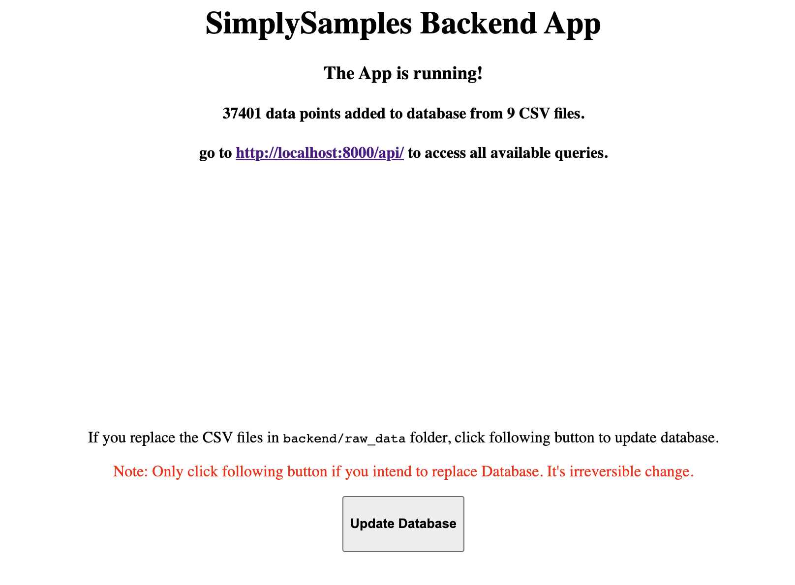

# SJHack2022_Project6 - SimplySamples

This project is humble attempt of BioHackathon Team #6 to solve sample management problem faced by many lab scientists working hardly to gather all sample data and figure out connections between them. 

Aim of this project is to..
* provide single webpage to view, edit and add sample data. 
* Show/hide, filter and export any column from any table.
* Upload their own data as CSV files.  

[Click here](https://sjcrh-my.sharepoint.com/:p:/g/personal/jpatel2_stjude_org/EQnYTPckPfFGuRqsu74-7MABgkBWt_fJ1V4JyOWyZaKyaA?e=swJkmZ) to check Presentation from the St. Jude BioHackathon 2022.

Example Demo app:


 
<!-- ABOUT THE PROJECT -->
## About The Project

<p align="right">(<a href="#top">back to top</a>)</p>

### Built With

* [Docker](https://www.docker.com/)
* [Django](https://www.djangoproject.com/)
* [React](https://reactjs.org/)
* [React Table](https://react-table.tanstack.com/)
* [Tailwind](https://tailwindui.com/)

### Architecture

<p align="right">(<a href="#top">back to top</a>)</p>

<!-- GETTING STARTED -->
## Getting Started

To get a local copy up and running follow these simple example steps:

### Prerequisites

* Docker Installation - Download apporpirate Docker installtion file for your OS: https://docs.docker.com/get-docker/

### Installation and setup

1. Once docker is installed, clone the repo on you local folder:
   ```sh
   git clone https://github.com/stjude-biohackathon/SJHack2022_Project6.git
   ```
2. Go to the repo root and run this docker commands to build image (will take few minute for first time, should be faster on sunsequent run): 
   ```sh
   cd SJHack2022_Project6
   docker-compose build
   ```
3. Start database container first using following command:
   ```sh
   docker-compose up db
   ```
   Once you see following LOG in terminal, go to next step:
   ```sh
   db_1   | LOG:  database system is ready to accept connections
   ```
4. Open new terminal tab and start Django app container using following command:
   ```sh 
   docker-compose up backend
   ```
   Once you see following LOG in terminal, the backend app is ready!
   ```sh
   web_1  | Starting development server at http://0.0.0.0:8000/
   web_1  | Quit the server with CONTROL-C.
   ```
5. To load the database to the Django backend go to this url: http://localhost:8000/
   It will take sometime to load the page as it's working on loading data from csv files to database.
   Once dtatabse is loaded, the page will show how many records and tables are loaded to database.

6. Open new terminal tab and start React app container using following command:
   ```sh 
   docker-compose up frontend
   ```
   Once you see following LOG in terminal, the frontend app is ready!
   ```sh
   sjhack2022_project6-frontend-1  | 
   sjhack2022_project6-frontend-1  | webpack 5.72.0 compiled with 1 warning in 522 ms
   ```
   frontend app can be accessed at: http://localhost:3000/

<p align="right">(<a href="#top">back to top</a>)</p>


<!-- USAGE EXAMPLES -->
## Usage

Note: Following steps are temporary till users can upload their own data from frontend page. (ETA feature release - April 30, 2022)

### Upload CSV data


1. To upload your own data, convert all your excel to 1 CSV file per table.

2. Copy all your CSV files to `backend/raw_data/` folder.

### Repouplate database with your data

To repopulate database with your csv files, go to http://localhost:8000/ and Click "Update Database" button. </br> The page will looks like this:


It will take sometime to load the page as it's working on loading data from csv files to database.
Once dtatabse is loaded, the page will show how many records and tables are loaded to database.

To see your data on frontend go to this url: http://localhost:3000/
<p align="right">(<a href="#top">back to top</a>)</p>

<!-- deployment -->
## deployment

As this Application is using Docker, it's easy to deploy it to any server or cloud service like AWS. </br>
Detailed instrunction on deployment will be available soon. 

<p align="right">(<a href="#top">back to top</a>)</p>

<!-- ROADMAP -->

## Roadmap

- [x] Add Django Backend
- [x] Support Rest api with sample db
- [x] Add React frontend
- [x] Show sample data in table
- [x] Allow filtering of data
- [x] Allow users to select any column from any tables
- [x] Allow users to export data into csv file or generate reports
- [ ] Allow users to add new tables or new data for existing tables
- [ ] Add security feature by implementing login

<p align="right">(<a href="#top">back to top</a>)</p>

<!-- ROADMAP -->

## Developed by Team Sigma 6

### web developer and dev-ops experts

* Jaimin Patel <a href="https://linkedin.com//in/jaimin-patel-bioinfo/"></a>
* Kennon Silence <a href="https://www.linkedin.com/in/kennonsilence/"></a>
* Karthik Vadambacheri Manian <a href="https://www.linkedin.com/in/karthikvm/"></a>

### Data cleaning and Data management experts

* Jia Sujuan <a href="https://www.linkedin.com/in/sujuan-jia-6b24b518/"></a>
* Kubra Bahcivanci <a href="https://www.linkedin.com/in/kubra-bahcivanci-mba-healthcare-management-b34bb11b4/"></a>
* Pei-Lin Chen <a href="https://www.linkedin.com/in/pei-linchen/"></a>